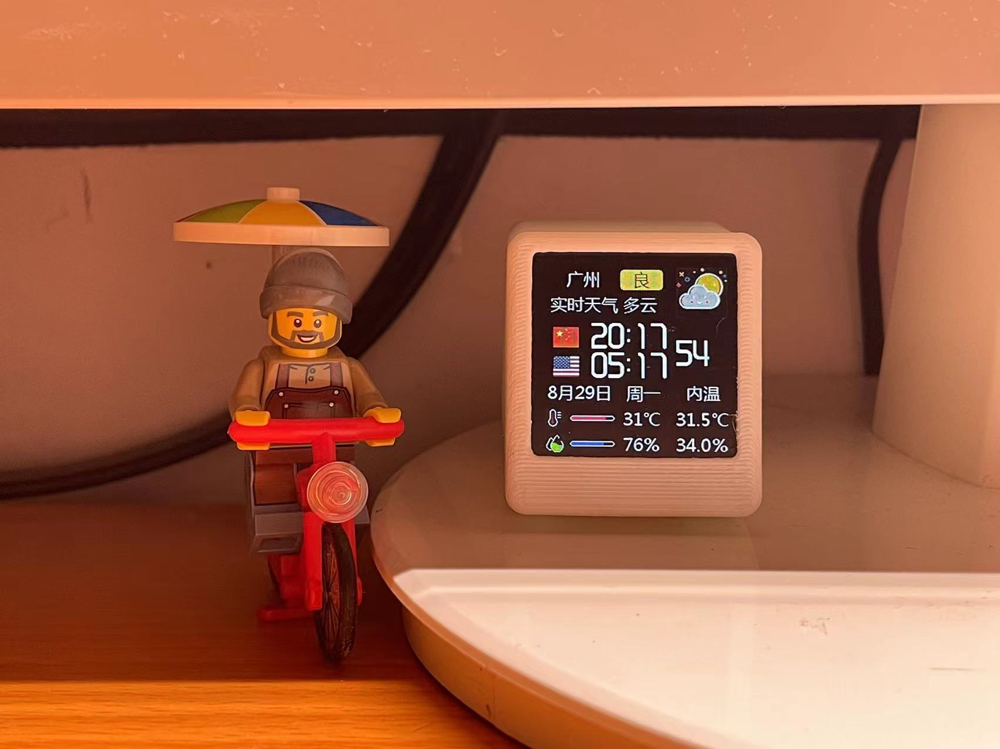

# SmallDesktopDisplay 

A compact, customizable desktop clock with multi-time zone display, weather updates, and sensor integration.

## Overview

This project involves creating a small desktop display using ESP8266 microcontrollers. It not only shows the current time but also provides weather updates, humidity, and temperature readings from both local sensors and online sources. Here's what it offers:

- **Time Display**: Shows the current time for multiple time zones, automatically synchronized via NTP servers.
- **Weather Information**: Fetches weather data to display current conditions, forecast, and local sensor readings.
- **Configuration via Web Interface**: Users can set up the device through an intuitive web panel.

## Features

- **Multi-Time Zone Display**: Displays time for various countries or regions.
- **Time Synchronization**: Automatically syncs with NTP to display accurate time for all zones.
- **Weather Updates**: Pulls weather data from an API (e.g., OpenWeatherMap).
- **Local Sensor Data**: Monitors room temperature and humidity with an onboard sensor.
- **Adjustable Settings**:
  - Time Zones
  - Brightness
  - Weather API key
  - Sensor Calibration
- **Power Management**: Designed for low power consumption to allow for battery operation.

## Hardware Requirements

- ESP8266 
- LCD Display (compatible with I2C)
- DHT22 or similar sensor for temperature and humidity
- Power supply (USB with appropriate voltage regulator)

## Software Setup

- **PlatformIO with VSCode**:
   - Install PlatformIO from the VSCode marketplace.
   - Clone or download this repository to your workspace.

## Usage

- **First Time Setup**: Power up the device. It will create a WiFi access point. Connect to this network to configure settings via the web interface.
- **Daily Use**: The device will automatically connect to your WiFi, sync time for multiple zones, fetch weather data, and update the display.

If you like my project, please give me a ⭐, thank you~